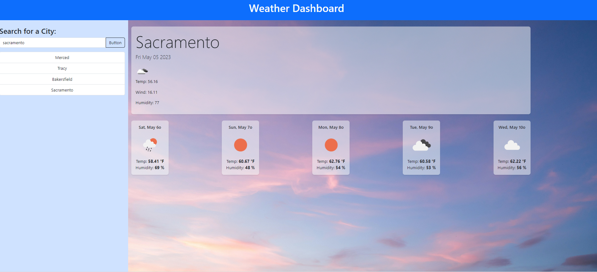

## Weather Dashboard

Introducing our innovative weather search feature! When you search for a city, you are not only provided with the present weather conditions but also a glimpse into the future forecast.

Upon entering the city name, our system instantly presents you with a comprehensive snapshot of the current weather condition. You will find the name of the city prominently displayed, along with the date, and a detailed description of the prevailing weather conditions. This includes vital information such as temperature, humidity levels, and wind speed, giving you a complete understanding of the atmospheric conditions at that moment.

## Images

## Links

[Github](https://github.com/siahmoymajid/Weather-dashboard)
[Deployed](https://siahmoymajid.github.io/Weather-dashboard/)
